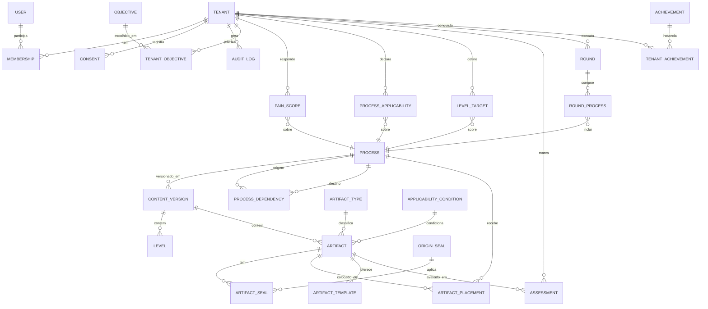

# Spec 000 — Modelo de Dados do Núcleo

> **Tipo:** especificação de dados (o QUÊ). Define o modelo conceitual/lógico do núcleo
> — entidades, relações, invariantes e critérios de aceite — que precede qualquer código
> (roadmap, Passo 1). **Não é migração nem DDL final**: o schema físico, índices definitivos
> e migrações vão em `plan.md`/`tasks.md`, revisados linha a linha (constituição §3).
>
> **Status:** rascunho para revisão humana. A seção 9 (Autocrítica) já roda o desenho contra
> o checklist inegociável e registra os pontos que **bloqueiam** aprovação até serem decididos.

---

## 1. Objetivo e escopo

O núcleo é o **motor de processos e artefatos** (módulo 4) somado ao que a jornada do centro
grava sobre ele (módulos 1–3, 5–8). Errar este schema custa migrações dolorosas depois, porque
quase tudo lê dele.

**Dentro do escopo desta spec:**

- Catálogo de conteúdo versionado (processos, níveis, artefatos, tipos, selos, dependências,
  templates) — publicado pela equipe TrialScale via CMS.
- Identidade e multi-tenancy (centro, usuários, papéis, consentimento LGPD, auditoria).
- Avaliação e jornada do centro (objetivos priorizados, termômetro de dor, marcação de
  artefatos/Raio-X, metas de nível, rodadas, gamificação).

**Fora do escopo (adiado — plano §2):** KPIs do centro (12), Universidade corporativa e
autoauditoria (13). Benchmark (10) e planos/monetização (11) entram só com as tabelas mínimas;
a regra de recorte é lógica de consulta, não de schema.

**Não modelamos (constituição §2, inegociável):** nenhum dado identificável de participante de
pesquisa; nenhuma identificação de protocolo ou patrocinador. A marcação de artefatos é
**autodeclarada** e não há anexo de evidências pelo centro (concepção §3). O único storage de
arquivos é para **templates** publicados pela equipe TrialScale (anexos assimétricos, plano §1).

---

## 2. Glossário e as duas zonas do modelo

| Termo | Significado |
|-------|-------------|
| **tenant** | O centro de pesquisa. Raiz do isolamento. |
| **process / level / artifact** | Catálogo de maturidade (conteúdo de referência). |
| **placement** | Colocação de um artefato em um processo, num nível, como essencial/complementar. Habilita artefato compartilhado. |
| **assessment** | Marcação do estado de um artefato pelo centro (Raio-X). |
| **pain_score** | Nota 1–5 do termômetro de dor por processo. |
| **objective** | Objetivo estratégico (Fase 1); o centro seleciona e ordena. |
| **round** | Rodada de 3–4 processos que o centro escolhe melhorar. |
| **DoD** | Definição de pronto do artefato (frase completa). |
| **content_version** | Versão de conteúdo de um processo (rascunho → publicado). |

O modelo tem **duas zonas** com regras de escopo opostas — a distinção é a decisão estruturante
desta spec:

- **Zona de conteúdo (referência global).** Catálogo publicado pela TrialScale, **compartilhado
  entre todos os tenants**. Não é "dado de centro"; por isso **não** carrega `tenant_id`. É a
  exceção justificada à regra 1 da constituição (ver §7).
- **Zona de centro (dados do tenant).** Tudo que um centro específico grava. **`tenant_id NOT
  NULL`** e presente em todo índice de acesso, sem exceção.

**Processos personalizados são a ponte entre as zonas:** um centro pode cadastrar processos
próprios com a mesma mecânica (concepção §3). Eles vivem nas tabelas de catálogo, mas com
`tenant_id` preenchido. Assim, `tenant_id NULL` = referência global; `tenant_id` preenchido =
conteúdo do centro. Essa dupla natureza tem custo de isolamento — tratada em §7 e §9.

---

## 3. Diagrama de entidades (ERD)

Lookups fixos (`ARTIFACT_TYPE`, `ORIGIN_SEAL`, `OBJECTIVE`, `APPLICABILITY_CONDITION`,
`ACHIEVEMENT`) são referência global sem `tenant_id`.

---

## 4. Zona de conteúdo (catálogo de referência)

### 4.1 `process`
O processo do catálogo (28 da tese) **ou** um processo personalizado do centro.

| Campo | Tipo | Notas |
|-------|------|-------|
| `id` | PK | |
| `tenant_id` | FK → tenant, **NULL** | NULL = catálogo global; preenchido = personalizado do centro. |
| `code` | varchar | Ex.: `2.5`. NULL para personalizados sem código de tese. |
| `name` | varchar | |
| `process_group` | enum | `central` · `suporte` · `gestao` · `personalizado`. |
| `one_line_description` | text | Descrição de uma linha do termômetro. |
| `objective_text` | text | Objetivo (tese). |
| `is_benchmarkable` | bool | Sempre `false` quando `tenant_id` preenchido (personalizado fora do benchmark). |

**Invariante:** `tenant_id IS NOT NULL → is_benchmarkable = false` (concepção §3).

### 4.2 `content_version`  *(versionamento rascunho/publicado)*
Unidade de curadoria e publicação. **A granularidade de versão é o processo.**

| Campo | Tipo | Notas |
|-------|------|-------|
| `id` | PK | |
| `process_id` | FK → process | |
| `version_no` | int | Incremental por processo. |
| `status` | enum | `rascunho` · `publicado` · `arquivado`. |
| `published_at` | datetime (UTC) | NULL enquanto rascunho. |
| `created_by` | FK → user | Staff TrialScale. |
| `notes` | text | Changelog editorial. |

**Regras:**
- Centros só enxergam a versão `publicado` corrente (plano §3). Editar cria novo `rascunho`;
  publicar arquiva a anterior.
- No máximo uma versão `publicado` "corrente" por processo. MySQL não tem índice único parcial;
  a exclusividade fica na aplicação + índice sobre (`process_id`, `status`) — ver risco em §9.
- `level`, `artifact` e `artifact_placement` pertencem a uma `content_version` (não ao `process`
  diretamente): assim uma versão é um **snapshot imutável** depois de publicada.

### 4.3 `level`
Os cinco níveis (1 Inicial → 5 Otimizado), com caracterização **por processo/versão**.

| Campo | Tipo | Notas |
|-------|------|-------|
| `id` | PK | |
| `content_version_id` | FK | |
| `number` | tinyint | 1–5. |
| `name` | varchar | Inicial/Informal/Definido/Gerenciado/Otimizado. |
| `description` | text | O que caracteriza o nível neste processo. |

Nível 1 normalmente não tem artefatos essenciais (é o estado de partida).

### 4.4 `artifact_type` e `origin_seal` (lookups fixos)
- **`artifact_type`** (vocabulário fixo, concepção §3): Infraestrutura · POP · Ferramenta de
  gestão · Indicador · Treinamento · Registro/evidência.
- **`origin_seal`** (selo de origem, concepção §9): `T` tese · `G` GCP · `A` norma/ANVISA ·
  `P` PIC · `D` design.

### 4.5 `artifact`
O artefato caracterizado que define maturidade.

| Campo | Tipo | Notas |
|-------|------|-------|
| `id` | PK | |
| `content_version_id` | FK | Pertence à versão do **processo-dono**. |
| `tenant_id` | FK, NULL | Herda a natureza do processo-dono (global vs. personalizado). |
| `logical_key` | varchar | Chave estável do artefato **entre versões** (permite ligar v1↔v2 e migrar assessments). |
| `artifact_type_id` | FK | |
| `title` | varchar | |
| `dod_text` | text | Definição de pronto como frase completa (concepção §3). |
| `owner_process_id` | FK → process | Processo-dono do artefato compartilhado. |
| `applicability_condition_id` | FK → applicability_condition, NULL | Ex.: `centro_publico` (compras públicas), `possui_pi_refrigerado`. |

- **`artifact_seal`** (N:N artefato × selo): um artefato pode ter múltiplos selos (`[T][G]`,
  `[T][A]`…), como no conteúdo do MVP.

### 4.6 `artifact_placement`  *(o coração do compartilhamento e da classificação E/C)*
Coloca um artefato em um processo, num nível, com uma classificação. **É o que permite marcar
uma vez e contar em vários processos.**

| Campo | Tipo | Notas |
|-------|------|-------|
| `id` | PK | |
| `artifact_id` | FK | |
| `process_id` | FK | Pode ser diferente do `owner_process_id` (artefato referenciado). |
| `level_number` | tinyint | 1–5 — em que nível o artefato conta **neste** processo. |
| `classification` | enum | `essencial` · `complementar`. |

- **Único** (`artifact_id`, `process_id`).
- Nível e classificação vivem no placement (não no artefato): o mesmo artefato compartilhado
  pode ser essencial no processo-dono e complementar/em outro nível num processo que o referencia
  (ex.: delegation form, dono = 7, referenciado em 2.5).
- **Integridade (RN-5):** `level_number` deve casar com uma linha `level` existente da versão
  daquele processo (não um `tinyint` solto); e todo artefato deve ter ao menos um placement no seu
  `owner_process_id` (um artefato "dono de 7" que não conta em 7 é inconsistente).
- **Versão de referência do placement cruzado (RN-2):** quando `process_id ≠ owner_process_id`,
  o placement referencia o artefato na versão do **processo-dono**. Consequência a documentar: o
  Raio-X de um processo é uma **composição** de placements de versões diferentes — logo a
  invariante correta é "snapshot do processo-**dono**", não "do processo exibido" (corrige §4.2).

### 4.7 `process_dependency`
Dependências entre processos (setas da arquitetura). Informam **ordem recomendada** na
priorização; **não travam** a navegação (concepção §4).

| Campo | Notas |
|-------|-------|
| `from_process_id`, `to_process_id` | Ambos do catálogo global. |
| `type` | Ex.: `aciona`, `acionado_por`, `alimenta`. |

### 4.8 `objective_process_weight`  *(elo objetivo → processo — insumo da ponderação)*
Referência global curada pela TrialScale: **quais processos servem a cada objetivo** e com que
relevância. Sem isso, o nível geral ponderado e a priorização (dor × relevância estratégica)
não têm insumo de peso — ver BN-1 em §9.

| Campo | Tipo | Notas |
|-------|------|-------|
| `objective_id` | FK → objective | |
| `process_id` | FK → process (global) | |
| `weight` | decimal | Relevância do processo para o objetivo. |

O peso de um processo para um centro = agregação de `weight` sobre os objetivos que aquele centro
priorizou (`tenant_objective`), combinado com o `priority_rank`.

### 4.9 `artifact_template`
Templates para download anexados **pela equipe TrialScale** (anexos assimétricos, plano §1).

| Campo | Notas |
|-------|-------|
| `artifact_id` | FK. |
| `file_ref` | Referência ao objeto no storage próprio da plataforma. |
| `filename`, `mime_type`, `size_bytes` | Metadados. |

Nenhum upload de centro aqui — só conteúdo próprio da plataforma.

---

## 5. Zona de centro (dados do tenant — `tenant_id NOT NULL`)

### 5.1 Identidade
- **`tenant`** — o centro. Raiz do isolamento (seu PK **é** o escopo; único caso sem coluna
  `tenant_id`). Cadastro (decisão do usuário, 2026-07-23 — supersede a redação da concepção §7 e o
  ON-1): `tipo_instituicao` enum(`publica`/`privada`/`terceiro_setor` — substitui "misto"),
  `cidade` + `estado` (UF), `protocolos_ativos_faixa` enum(`0_10`/`11_30`/`31_50`/`51_100`/
  `101_200`/`200_mais` — faixas 51-100/100-200 normalizadas por sobreposição no 100), `tamanho`,
  `fase_estudos`, `tempo_existencia`, `plan_id`. Sem protocolo/patrocinador.
  - **Nota LGPD:** cidade/estado são mais granulares que a diretriz "em faixas" da concepção §7
    (risco de reidentificação em mercado concentrado). Decisão consciente do usuário; a proteção
    permanece na regra do benchmark (nunca exibir recorte com <5 tenants, constituição §5) — e o
    benchmark deve tratar cidade como dimensão sensível (agregar por UF/região quando o recorte
    municipal ficar abaixo do mínimo).
  - **Especialidades** viraram N:N: lookup global **`specialty`** (36 especialidades médicas
    seedadas, editáveis via backoffice) + **`tenant_specialty`** (`tenant_id NOT NULL`, único por
    (`tenant_id`, `specialty_id`)) — substitui o varchar da versão anterior.
  - **Atributos de perfil que as condições de aplicabilidade consultam** (BN-2): o
    `tipo_instituicao` resolve `centro_publico`; mas condições como `possui_pi_refrigerado` /
    `possui_amostras` (processo 8) precisam de atributos próprios do perfil. O conjunto exato
    desses atributos é decisão a fechar (Q7) — sem ele, o N/A de artefato condicional (C2) não
    tem em que se apoiar.
- **`user`** — identidade de pessoa. **Sem `tenant_id`** (exceção justificada, §7): uma pessoa é
  global e se vincula a centro(s) via membership. Flag `is_staff` marca a equipe TrialScale
  (backoffice), que não pertence a nenhum tenant.
- **`membership`** — vínculo `tenant_id` + `user_id` + `role` enum(`administrador`,
  `coordenador`, `membro`). Único (`tenant_id`, `user_id`).
- **`consent`** — consentimento LGPD **versionado** (constituição §5): `tenant_id`, `user_id`,
  `consent_version`, `consented_at` (UTC), `text_ref`. Nunca sobrescrito; cada versão é uma linha.
- **`audit_log`** — eventos sensíveis: `tenant_id`, `user_id`, `event_type`, `entity`,
  `entity_id`, `metadata` (JSON), `created_at` (UTC). **`metadata` é allow-list**, não payload
  livre: é a única porta plausível de vazamento de PII e não é pega por um teste de coluna
  (constituição §2, §5) — ver RN-4/AC-14.

### 5.2 Fase 1 — objetivos estratégicos
- **`objective`** (lookup global) — menu de objetivos agrupado por tema (concepção §2).
- **`tenant_objective`** — `tenant_id`, `objective_id`, `priority_rank` (int). Único
  (`tenant_id`, `objective_id`). Captura a **prioridade relativa**; combinada com
  `objective_process_weight` (§4.8), produz o peso por processo que pondera nível geral e
  priorização.

### 5.3 Termômetro e aplicabilidade
- **`pain_score`** — `tenant_id`, `process_id`, `score` (1–5), `updated_at`. Único
  (`tenant_id`, `process_id`). Salvar/retomar = upsert parcial.
- **`process_applicability`** — "não se aplica" com justificativa (concepção §3):
  `tenant_id`, `process_id`, `applies` bool, `na_justification` text. Processo N/A sai do cálculo
  do nível geral e a justificativa aparece no relatório.

### 5.4 Metas e Raio-X
- **`level_target`** — meta de nível por processo (concepção §4; aprendizado da leva de conteúdo):
  `tenant_id`, `process_id`, `target_level` (1–5). Único (`tenant_id`, `process_id`) — RN-5.
- **`assessment`** — marcação do artefato (Raio-X):

| Campo | Tipo | Notas |
|-------|------|-------|
| `id` | PK | |
| `tenant_id` | FK, **NOT NULL** | |
| `artifact_id` | FK | Aponta para a linha de artefato **daquela versão** (fixa a versão avaliada). |
| `state` | enum | `nao_iniciado` · `em_elaboracao` · `completo`. |
| `expected_due_date` | date, NULL | Só faz sentido em `em_elaboracao` (data-limite do kanban). |
| `completed_at` | datetime (UTC), NULL | |

- Único (`tenant_id`, `artifact_id`). Uma marcação por centro por artefato — por isso um
  artefato compartilhado marcado uma vez **conta em todos** os processos que o colocam.
- N/A de **artefato** condicional (ex.: compras públicas para centro privado) é **derivado**:
  `applicability_condition` do artefato avaliada contra o perfil do tenant. Não precisa de linha
  de assessment; o motor o exclui do cálculo. (N/A de **processo** inteiro fica em
  `process_applicability`.)
- **Transparência do N/A derivado (RN-3):** exclusões por condição precisam ser **rastreáveis no
  relatório** (qual artefato saiu, por qual atributo do perfil), à paridade com o `na_justification`
  do N/A de processo — senão um perfil mal preenchido infla o nível em silêncio.
- **Fragilidade sob versionamento (RN-1, interage com Q1):** como `artifact_id` aponta para a linha
  de artefato **de uma versão**, publicar v2 (nova linha, mesmo `logical_key`) deixa os assessments
  presos em v1. "Marcar uma vez conta em todos" é, hoje, promessa de **aplicação**, não invariante
  de schema. A avaliar no `plan.md`: chavear o assessment por `(tenant_id, logical_key)` + contexto
  de versão, tornando a persistência da marcação estrutural.

### 5.5 Rodadas e gamificação
- **`round`** — `tenant_id`, `sequence_no`, `status` enum(`aberta`, `concluida`), `started_at`,
  `completed_at`, `challenge_weeks` (int, NULL = sem desafio de tempo).
- **`round_process`** — `round_id`, `process_id` (3–4 por rodada).
- **`achievement`** (lookup global) + **`tenant_achievement`** (`tenant_id`, `achievement_id`,
  `earned_at`) — selos/medalhas.

### 5.6 O nível é **calculado**, não gravado
O nível não é fonte de verdade armazenada; o **motor de cálculo** o deriva (roadmap §6, suíte de
bordas). Regra:
- **Nível por processo** = maior nível N tal que **todos os artefatos essenciais** dos níveis ≤ N
  (aplicáveis ao centro) estão `completo`. Complementares somam progresso, não travam.
- **Nível geral** = média ponderada dos níveis por processo pela relevância estratégica
  (`tenant_objective`). Processos N/A saem do cálculo. Personalizados entram no painel do próprio
  centro, mas **não** no benchmark.
- Uma tabela de cache (`process_level_snapshot`) é **opcional** e derivável; nunca a verdade.

---

## 6. Como o modelo atende cada caso obrigatório

Casos do checklist (db-architect + roadmap Passo 1):

| # | Caso que o schema PRECISA suportar | Como o modelo atende |
|---|-----------------------------------|----------------------|
| C1 | **Artefato compartilhado entre processos, com processo-dono** | `artifact.owner_process_id` + múltiplos `artifact_placement`. Um `assessment` por (tenant, artefato) conta em todos — ✅ **dentro de uma versão**; frágil na troca de versão (RN-1). |
| C2 | **Artefato condicional ao perfil** (compras públicas) | `artifact.applicability_condition_id` avaliada contra o perfil do `tenant`. ⚠️ **Parcial:** falta definir os atributos de perfil que condições como `possui_pi_refrigerado` consultam (BN-2/Q7). |
| C3 | **Processo personalizado por tenant (fora do benchmark)** | `process.tenant_id` preenchido + `is_benchmarkable = false`. ⚠️ Escopo das tabelas-filhas de conteúdo custom é só transitivo (BN-3). |
| C4 | **Versionamento (rascunho/publicado) sobre avaliações existentes** | `content_version` por processo; `assessment → artifact` fixa a versão; `logical_key` liga versões. ⚠️ **Comportamento** da transição indeciso (B1/Q1). |
| C5 | **"Não se aplica" com justificativa** | `process_applicability` (processo) e condição derivada (artefato). ⚠️ N/A de artefato hoje é silencioso (RN-3). |
| C6 | **Estados do artefato com data-limite** | `assessment.state` (3 estados) + `expected_due_date`. ✅ |
| C7 | **Meta de nível por processo** | `level_target`. ✅ |
| C8 | **Cálculo de nível por essenciais completos** | `artifact_placement.classification` + motor (§5.6). Nível **por processo** ✅; nível **geral ponderado** depende de `objective_process_weight` (§4.8, BN-1). |

---

## 7. Mapeamento contra os princípios inegociáveis (constituição + regras do db-architect)

| Princípio | Como o modelo cumpre | Exceções (justificadas) |
|-----------|----------------------|--------------------------|
| **1. Isolamento de tenant** (`tenant_id NOT NULL`, em todo índice) | Toda tabela de centro (§5) tem `tenant_id NOT NULL` e o compõe nos índices. | **`user`** (identidade global; escopo vem de `membership`). **Catálogo** (`process`, `content_version`, `level`, `artifact`, `placement`, `dependency`, `template`, `objective_process_weight`): referência global; `tenant_id` NULL = global, preenchido = personalizado. **Lookups** (`artifact_type`, `origin_seal`, `objective`, `applicability_condition`, `achievement`). ⚠️ **Exceção mal fechada (BN-3):** só `process`/`artifact` têm a coluna anulável; `content_version`/`level`/`placement` de um processo custom ficam escopadas só transitivamente via `process_id` — a decidir em Q2. |
| **2. Sem migração destrutiva sem rollback+backup** | Primeira migração é greenfield. Publicação de conteúdo **nunca** faz UPDATE destrutivo: cria nova `content_version`; versões antigas são arquivadas, não apagadas. | — |
| **3. Dinheiro em DECIMAL** | `plan.amount DECIMAL(10,2)` (planos R$ 3.870,00 / R$ 7.500,00). Nenhum outro valor monetário no núcleo. | — |
| **4. Datas UTC; utf8mb4** | Todos os `datetime/timestamp` em UTC; `utf8mb4` em todo o schema (evita a armadilha de charsets mistos do legado). | — |
| **5. Sem dados de participante** | Nenhuma tabela/coluna de participante, protocolo ou patrocinador. Marcação autodeclarada; sem anexo de evidência do centro; storage só para templates da plataforma. | — |
| **LGPD** (constituição §5) | `consent` versionado; campos analíticos do `tenant` **em faixas**; benchmark com mínimo de 5 tenants por recorte (regra na camada de consulta, não no schema). | — |
| **Simplicidade** (constituição §7) | Nível calculado, não duplicado; cache opcional só quando doer; sem abstração antes da 3ª repetição. | — |

---

## 8. Critérios de aceite (verificáveis → viram testes)

**Isolamento (suíte permanente 1 — falha = bloqueio de merge):**
- AC-1: toda leitura/escrita em tabela da zona de centro exige `tenant_id`; tenant A nunca lê/escreve dado de B.
- AC-2: consulta de conteúdo de um tenant retorna catálogo global (`tenant_id IS NULL`) **mais**
  os personalizados **daquele** tenant, e **nunca** personalizados de outro.

**Motor de cálculo (suíte permanente 2 — bordas antes do código):**
- AC-3: nível por processo = todos os essenciais dos níveis ≤ N completos; complementar faltante não trava.
- AC-4: artefato compartilhado marcado `completo` uma vez conta em todos os processos que o colocam.
- AC-5: processo N/A sai do nível geral; artefato condicional não aplicável ao perfil sai do cálculo do processo.
- AC-6: personalizado entra no nível geral do próprio centro e **nunca** no benchmark.
- AC-7: publicar nova `content_version` **não** altera assessments existentes; a regra de transição é aplicada explicitamente (ver Q1).
- AC-8: nível geral = média ponderada pelo peso por processo (`objective_process_weight` ×
  `tenant_objective`); N/A excluído. Sem o elo objetivo→processo, o AC é insatisfazível (BN-1).

**Integridade e conformidade:**
- AC-9: `assessment.expected_due_date` só é aceito com `state = em_elaboracao`.
- AC-10: `process.tenant_id IS NOT NULL ⇒ is_benchmarkable = false`.
- AC-11: no máximo uma `content_version` `publicado` corrente por processo.
- AC-12: benchmark não exibe recorte com menos de 5 tenants.
- AC-13: nenhuma tabela do núcleo contém coluna de participante/protocolo/patrocinador (teste de schema).
- AC-14: `audit_log.metadata` só aceita chaves da allow-list; teste de **conteúdo** (não só de coluna) garante ausência de PII (RN-4).
- AC-15: `artifact_placement.level_number` referencia um `level` existente da versão; todo artefato tem placement no seu `owner_process_id` (RN-5).
- AC-16: exclusão de artefato por condição de perfil é registrada e exibível no relatório (paridade com N/A de processo, RN-3).

---

## 9. Autocrítica — o desenho contra o checklist

Revisão do próprio modelo, classificada **BLOQUEIA / RECOMENDA / OPCIONAL** (padrão db-architect).
Os itens BLOQUEIA precisam de decisão **antes** de virar `plan.md`. Esta seção passou por **duas
passadas**: a autocrítica original (B1–B3, R1–R4, O1–O3) e uma **revisão independente do agente
`db-architect`**, que acrescentou o que a primeira não viu (BN-1–BN-3, RN-1–RN-6, ON-1–ON-3). Os
itens `*N-*` vêm da segunda passada.

### 🔴 BLOQUEIA

- **BN-1 — Falta o elo objetivo→processo; o nível geral ponderado e a priorização são
  incalculáveis (C8/AC-8).** `tenant_objective` guarda a prioridade do centro por **objetivo**, mas
  nada no schema original ligava objetivo → processo (quais processos servem a "diminuir desvios").
  Sem esse mapa, o peso por processo não existe e a média ponderada não fecha — é o núcleo do
  produto (Fase 1 alimenta Fase 2). → **Corrigido no desenho** com `objective_process_weight`
  (§4.8); resta confirmar de onde vem a curadoria desses pesos (Q6). *Foi o pior achado e a
  autocrítica não o tinha visto.*

- **BN-2 — Artefato condicional sem o lado-tenant da condição (C2).** `applicability_condition`
  resolve `centro_publico` via `tenant.natureza`, mas `possui_pi_refrigerado`/`possui_amostras`
  (processo 8) não têm atributo correspondente no `tenant`. A condição fica pendurada; o motor não
  tem em que apoiar o N/A derivado. → Definir o conjunto de atributos de perfil que as condições
  consultam (Q7) antes de prometer C2.

- **BN-3 — Tabelas-filhas de conteúdo custom sem `tenant_id` (viola regra 1).** `content_version`,
  `level` e `artifact_placement` não têm coluna de tenant; quando o processo é personalizado, esse
  conteúdo é dado-de-centro escopado **só transitivamente** por `process_id`. Qualquer consulta que
  leia as filhas direto por `process_id` cruza tenants — superfície mais profunda que a do B2. →
  Propagar `tenant_id NOT NULL` nas filhas custom **ou** adotar a `custom_process` do Q2 (resolve
  de forma limpa). Coberto por AC-1/AC-2.

- **B1 — Regra de transição de conteúdo sobre avaliações existentes não está decidida (C4/AC-7).**
  O schema *suporta* (assessment fixa a versão; `logical_key` liga versões), mas o **comportamento**
  ("recalcular? congelar? notificar?") é uma decisão de produto em aberto (plano §6). Sem ela, o
  motor não tem especificação para o pior caso de borda. → **Decidir Q1 antes da Etapa 1** (o
  próprio plano exige isso).

- **B2 — `tenant_id` anulável no catálogo enfraquece a regra 1 de isolamento.** A consulta de
  conteúdo de um tenant é `WHERE tenant_id IS NULL OR tenant_id = :t` — exatamente o padrão que o
  mecanismo central de escopo tende a **esquecer** ou a **vazar** (um `OR` mal montado expõe
  personalizados de outro centro). É a maior superfície de risco do desenho. → O mecanismo central
  precisa de um caminho **explícito e testado** para "conteúdo publicado global + personalizado do
  tenant", coberto por AC-2 na suíte permanente 1. Alternativa a avaliar em `plan.md`: separar
  `custom_process` em tabela própria (tenant_id NOT NULL) em vez de anular a coluna — troca
  duplicação de mecânica por isolamento mais limpo.

- **B3 — Artefato compartilhado × versionamento por processo têm granularidades em conflito.**
  Um artefato pertence à `content_version` do processo-dono, mas é *colocado* (via placement) em
  processos que têm sua própria versão. Publicar uma nova versão do dono (7) muda um artefato que
  2.5 referencia — e nada no schema garante que 2.5 seja revalidado. → Decidir a **unidade de
  publicação** quando há compartilhamento (publicar o dono revalida os que referenciam?) e como o
  placement em outro processo aponta para a versão certa do artefato. Interage com B1.

### 🟡 RECOMENDA

- **RN-1 — "Marcar uma vez conta em todos" é promessa de aplicação, não invariante de schema.**
  Como `assessment.artifact_id` aponta para a linha de artefato **de uma versão**, publicar v2 (nova
  linha, mesmo `logical_key`) deixa os assessments presos em v1 (tudo vira `nao_iniciado`) até a
  migração rodar; e se a migração copiar, acumulam-se múltiplas linhas por artefato lógico por
  tenant. A fragilidade nasce de chavear por `artifact_id` e não por `logical_key`. → Avaliar
  `assessment` por `(tenant_id, logical_key)` + contexto de versão no `plan.md`. Interage com B1.

- **RN-2 — A versão-de-referência do placement cruzado torna falso o "snapshot imutável por
  versão".** O Raio-X de um processo compõe placements de versões diferentes (própria + do dono do
  artefato compartilhado). → Documentado no §4.6 como "snapshot do processo-**dono**"; afia o B3.

- **RN-6 — Padrão de consulta do catálogo é hostil a índice.** `WHERE tenant_id IS NULL OR
  tenant_id = :t` (AC-2) força index-merge/varredura da partição NULL — mais um argumento a favor
  de separar `custom_process` (Q2). Além disso, o kanban/desafio de tempo vai querer
  `(tenant_id, state)` e `(tenant_id, expected_due_date)` — prever no `plan.md`. Índices só entram
  no `plan.md`, mas os padrões de consulta (termômetro, Raio-X, cálculo, kanban) já ficam
  registrados aqui, todos com `tenant_id` à esquerda.

- **R1 — Exclusividade da versão publicada depende da aplicação (AC-11).** MySQL não tem índice
  único parcial; "uma publicada por processo" não é garantível só por constraint. Registrar como
  invariante testada e, no `plan.md`, avaliar coluna gerada + único composto como salvaguarda.

- **R2 — Selo de origem ainda é decisão pendente de confirmação** (concepção §3). O modelo já o
  inclui (`origin_seal` + `artifact_seal`); se for confirmado como recurso, custo zero. Se cair,
  as tabelas ficam órfãs. Baixo risco — manter, é barato e o conteúdo do MVP já usa os selos.

- **R3 — Validade/expiração de artefato não modelada** (pendência aberta, concepção §11: POPs
  vencem, equipes mudam). Fora do escopo do MVP, mas o `assessment` precisaria de `completed_at` +
  política de decaimento no futuro. `completed_at` já existe — a porta fica aberta sem custo agora.
  Não introduzir a regra antes da decisão de produto.

- **R4 — Comparabilidade do benchmark** (concepção §11): o nível geral ponderado pelos objetivos
  do centro **não é comparável** entre centros. O modelo permite recalcular um índice não ponderado
  a partir dos níveis por processo — registrar que o benchmark usa níveis por processo/índice não
  ponderado, não o nível geral ponderado.

- **RN-3 — N/A de artefato derivado é silencioso**, enquanto o N/A de processo é auditável. Perfil
  mal preenchido infla o nível sem rastro. → Corrigido no §5.4 e AC-16 (registrar/exibir exclusões).

- **RN-4 — `audit_log.metadata` (JSON) é a porta real de vazamento de PII**, e AC-13 só testa
  colunas. → Corrigido: allow-list no §5.1 + AC-14 (teste de conteúdo). Confirmado que o resto do
  modelo é limpo (marcação autodeclarada, sem conteúdo de artefato).

- **RN-5 — Lacunas de integridade menores**: `level_target` sem unicidade; `placement.level_number`
  solto sem FK ao `level`; artefato-dono sem placement obrigatório. → Corrigido no §4.6, §5.4 e AC-15.

### 🟢 OPCIONAL

- **ON-1 — `tenant.localizacao` precisa virar `regiao`/faixa** (reidentificação em mercado pequeno,
  concepção §7). → **Superseded (2026-07-23):** o usuário decidiu cadastro com `cidade`+`estado`;
  mitigação movida para a camada de benchmark (recorte municipal <5 tenants agrega por UF/região)
  — ver nota LGPD no §5.1.
- **ON-2 — `assessment.expected_due_date` como DATE sem fuso**: aceitável para prazo de kanban, mas
  lembrete por hora pode dar off-by-one. Anotar.
- **ON-3 — `round_process` sem `tenant_id`** (escopo transitivo via `round`): justificar como
  junção pura ou denormalizar `tenant_id` para o índice do kanban.
- **O1 — `process_level_snapshot` (cache de nível)** só quando a performance do painel exigir;
  hoje o cálculo é barato e a duplicação é risco de divergência (constituição §7).
- **O2 — `applicability_condition` como lookup vs. expressão.** Começar com lookup enumerado
  (`centro_publico`, `possui_pi_refrigerado`); só generalizar para regra composta se surgir a 3ª
  condição real (constituição §7).
- **O3 — Papel de coordenador "responsável por processo"** (concepção §2) não está modelado como
  vínculo processo↔usuário. Nesta versão o diagnóstico é de usuário único; adiar até haver
  atribuição real por processo.

### Três piores riscos do desenho (após as duas passadas)
1. **Priorização e nível geral não fecham** por falta do elo objetivo→processo (BN-1) — corrigido no
   desenho, mas era o gap mais importante e a autocrítica não o viu.
2. **Vazamento entre tenants no conteúdo custom**: `tenant_id` anulável (B2) + tabelas-filhas sem
   coluna de tenant (BN-3). A alternativa `custom_process` (Q2) fecha os dois de uma vez.
3. **Persistência da marcação frágil ao versionamento**: "conta uma vez em todos" e "snapshot
   imutável" quebram na publicação porque o assessment é chaveado por `artifact_id`, não por
   `logical_key` (RN-1 + RN-2 + B1/B3).

---

## 10. Perguntas em aberto (decisão humana antes da Etapa 1)

- **Q1 (bloqueia B1/AC-7):** ao publicar nova versão de um processo, o que acontece com centros já
  avaliados — recalcular contra o novo, congelar no antigo, ou notificar e deixar o centro migrar?
- **Q2 (bloqueia B2):** manter `tenant_id` anulável no catálogo ou separar `custom_process` em
  tabela dedicada com `tenant_id NOT NULL`?
- **Q3 (bloqueia B3):** unidade de publicação com compartilhamento — publicar o processo-dono
  dispara revalidação dos processos que referenciam o artefato?
- **Q4 (R2):** confirmar os selos de origem como recurso de produto.
- **Q5:** um `user` pode pertencer a mais de um `tenant` (consultoria/multi-centro) ou é 1:1 nesta
  versão? Afeta unicidade e a UX de troca de contexto.
- **Q6 (bloqueia BN-1):** de onde vem a curadoria de `objective_process_weight` (quais processos
  servem a cada objetivo e com que peso) — tabela fixa curada pela TrialScale, ou derivada das
  dependências da tese?
- **Q7 (bloqueia BN-2):** qual o conjunto de atributos de perfil do `tenant` que as condições de
  aplicabilidade consultam (além de `natureza`) — ex.: `possui_pi_refrigerado`, `possui_amostras`?

---

*Próximo passo do fluxo SDD: resolver Q1–Q3, Q6 e Q7, então escrever `plan.md` (schema físico,
índices compostos com `tenant_id`, mecanismo de escopo, migração revisável linha a linha) e
`tasks.md`. A revisão independente do `db-architect` já rodou (folded na §9); a aprovação humana
final do diff permanece obrigatória (constituição §3).*
